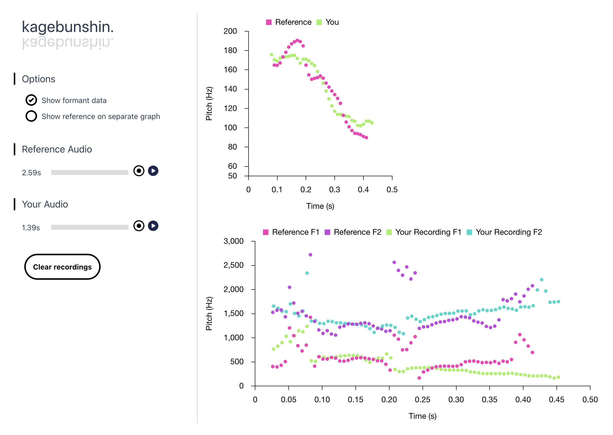

# Kagebunshin



I swear I will change the name at some point.

This webapp works best with audio routers like [Loopback](https://rogueamoeba.com/loopback/) for macOS. It allows you to record in a reference word, sentence, etc., then record your own voice for comparison.

Developed with Japanese in mind, its primary output is a graph of your pitch over time (for pitch accent comparison). It can also display vowel formants, but the output may be messy depending on the quality of your recording environment.

## Installation

Create and activate a Python environment:

```
cd kagebunshin
python -m venv env
source env/bin/activate
```

Install Python requirements:

```
cd backend
pip install -r requirements.txt
```

Install frontend requirements:

```
cd ../frontend
npm install
```

**NOTE:** In addition to the Python and NPM dependencies, you must have [Praat](https://www.fon.hum.uva.nl/praat/) and [ffmpeg](https://ffmpeg.org/) installed on your system to run this app.

## Usage

To run the server:

```
cd backend
flask run --port=5000 debug
```

And to run the frontend (from a separate terminal tab/window):
```
cd frontend
npm run dev
```